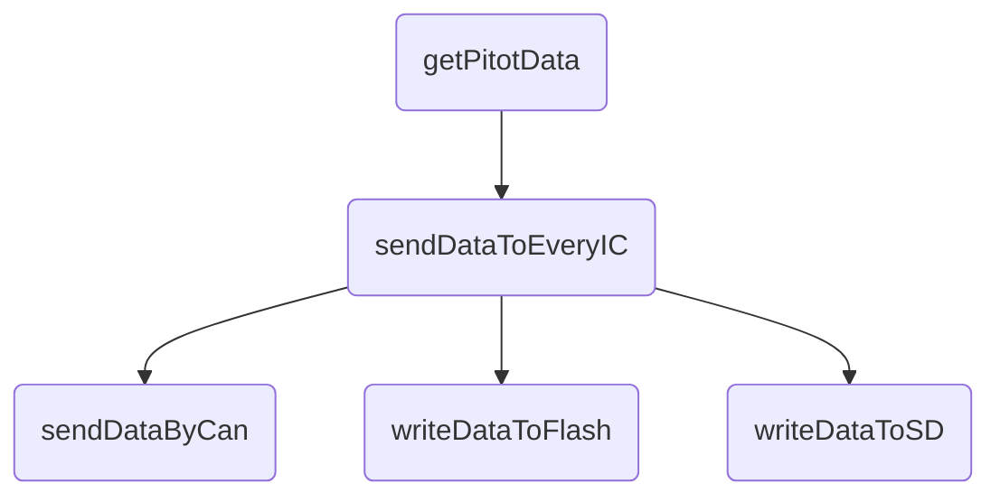

# 89Jのピトー管基板用です

## 現在の予定
基本的にFree RTOSでのタスク機能を利用して
 - ピトー管からデーターを得るタスク
 - それを他に送るタスク(CAN、 SPIFlash、 パリティ)
 - CANを送信するタスク
 - SPIFlashに書き込むタスク
 - MicroSDに書き込むタスク

の4つをタスクとして動作させたい。
MicroSDにログを書き込むようのタスクも作るか考え中

